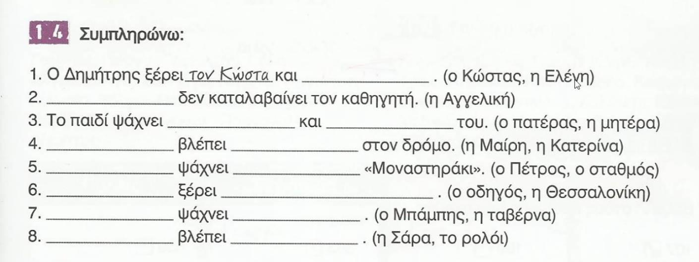
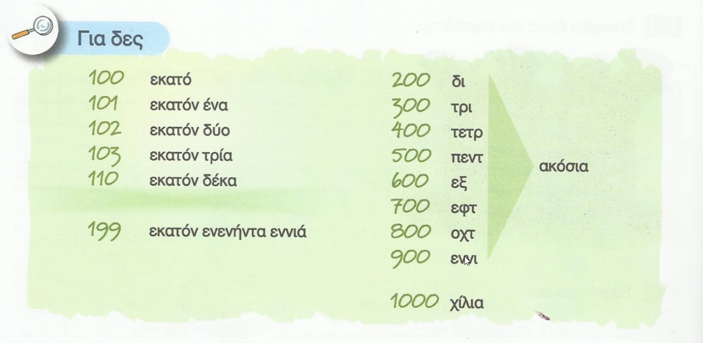
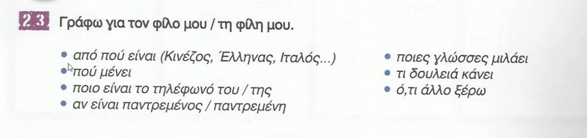

## 9 Γράφω προτάσεις. 

Η Εριέτα – Αλβανία  - Η Εριέτα είναι Αλβανή και μιλάει αλβανικά.

Ελλάδα = Греция
Ο Γιώργος – Ελλάδα - Ο Γιώργος είναι Έλληνας και μιλάει ελληνικά.

Σουηδία = Швеция (Суидíя)
Ο Ίνγκμαρ (И́нгмар) – Σουηδία - Ο Ίνγκμαρ είναι Σουηδός και μιλάει σουηδικά.

Πολωνία = Польша 
Η Άνια – Πολωνία - Η Άνια είναι Πολωνή και μιλάει πολωνικά.

Η Κατερίνα – Ελλάδα - Η Κατερίνα είναι Ελληνίδα και μιλάει ελληνικά.

Ο Γκαμές – Αίγυπτος - Ο Γκαμές είναι Αιγύπτιος και μιλάει αραβικά.

Η Ακίκο – Ιαπωνία - Η Ακίκο είναι Ιαπωνέζα και μιλάει ιαπωνικά.

Ο Πάτρικ – Γερμανία - Ο Πάτρικ είναι Γερμανός και μιλάει γερμανικά.

## 10 Συμπληρώνω με το μιλάω. = Заполните с глаголом "говорить".

    Εγώ - μιλάω
    Εσύ - μιλάς
    Αυτός/Αυτή/Αυτό - μιλάει

    Εμείς - μιλάμε
    Εσείς - μιλάτε
    Αυτοί/Αυτές/Αυτά - μιλάνε


Ζορζ: Εσύ, Ράιμερ, **μιλάς** ελληνικά;
<span class="extra">Ты, Ρаймер, говоришь по-гречески; </span>

Ράιμερ: Όχι πολύ καλά, αλλά καταλαβαίνω. Η γυναίκα μου είναι Ελληνίδα.
<span class="extra">Нет, не очень хорошо, но я понимаю. Моя жена - гречанка. </span>

Ζορζ: Εσύ και η γυναίκα σου **μιλάτε** γερμανικά στο σπίτι;

Ράιμερ: Όχι, **μιλάμε** αγγλικά.

Η Μαρίλε **μιλάει** καλά γερμανικά.
<span class="extra">Мариле хорошо говорит по-немецки.</span>

Εσείς, στον Λίβανο, τι γλώσσα **μιλάτε**;
*Вы, в Ливане, на каком языке говорите?*
<span class="extra">γαλλικά = французский </span>

Ζορζ: Στον Λίβανο **μιλάνε** αραβικά και γαλλικά.
Εγώ **μιλάω** γαλλικά με τη μητέρα μου
και αραβικά με τον πατέρα μου.
<span class="extra">μας = наш </span>

Η γυναίκα μου, η Νατάσα, και ο γιος μας **μιλάνε** ελληνικά.
Αλλά στο σχολείο το παιδί **μιλάει** αγγλικά.
<span class="extra">Моя жена, Наташа, и наш сын говорят по-гречески.
Но в школе ребенок говорит по-английски.</span>


## 11 Διαλέγω το σωστό.

<audio src="29 Track 29.mp3" style="width: 100%;" controls></audio>

**Ο Παναγιώτης :** Μαρίνα, ξέρεις την Μελέκ;

Είναι από την Τουρκία, αλλά μιλάει στην Αθήνα.

Είναι φοιτήτρια. Σπουδάζει αρχαιολογία.

Μελέκ, αυτή είναι η αδελφή μου, η Μαρίνα.

**Μελέκ:** Χαιρώ πολύ, Μαρίνα.

**Μαρίνα:** Κι εγώ. Μιλάς καλά **?** ελληνικά;

**Μελέκ:** Α, όχι και τόσο καλά. Τώρα μαθαίνω
<span class="extra">А, но не так хорошо. Сейчас учу. </span>

Στο σπίτι μιλάω τουρκικά και αγγλικά.

**Ο Παναγιώτης :** Και αυτός εδώ είναι ο Φου. 
<span class="extra">εδώ = здесь </span>

Δουλεύει οχτώ χρόνια στην Ελλάδα.
<span class="extra">Он работает восемь лет в Греции.</span>

Και μιλάει πολύ καλά ελληνικά.

**Φου:** Δεν μιλάω πολύ καλά, αλλά η γυναίκα μου, η Λι, μιλάει ελληνικά στη δουλειά της.
<span class="extra">Моя жена, Ли, говорит по-гречески на своей работе.</span>

```
Ο Παναγιώτης
☑ ξέρει τη Μελέκ
☐ δεν ξέρει τη Μαρίνα
☐ δε μιλάει ελληνικά

Η Μελέκ
☐ δε μιλάει τουρκικά
☐ μιλάει πολύ καλά ελληνικά
☑ μιλάει ελληνικά έτσι κι έτσι (έτσι κι έτσι = так себе)

Η Μελέκ
☑ μιλάει αγγλικά
☐ δουλεύει στην Ελλάδα
☐ μένει στη Θεσσαλονίκη

Ο Φου
☐ δε μιλάει καθόλου ελληνικά (καθόλου = совсем)
☑ δεν είναι παντρεμένος (παντρεμένος = женат)
☑ δουλεύει στην Ελλάδα

Η Λι
☑ μιλάει ελληνικά στη δουλειά της
☐ δε μιλάει ελληνικά
☐ δε δουλεύει
```


14 Συμπληρώνω: = Заполните:

Ο Δημήτρης ξέρει τον Κώστα και **την Ελένη**. (ο Κώστας, η Ελένη)

    = Дмитрис знает Костаса и Элени.

**Η Αγγελική** δεν καταλαβαίνει τον καθηγητή. (η Αγγελική)
    
    = Ангелики не понимает профессора.

    ψάχνει = ищет
Το παιδί ψάχνει **τον πατέρα** και **τη μητέρα** του. (ο πατέρας, η μητέρα)

    δρόμο = дорога
    βλέπει = видит
**Η Μαίρη** βλέπει **την Κατερίνα** στον δρόμο. (η Μαίρη, η Κατερίνα)

**Ο Πέτρος** ψάχνει **το σταθμό** «Μοναστηράκι». (ο Πέτρος, ο σταθμός)

    ο οδηγός = водитель
**Ο οδηγός** ξέρει **τη Θεσσαλονίκη**. (ο οδηγός, η Θεσσαλονίκη)
    = водитель знает Салоники.

**Ο Μπάμπης** ψάχνει **την ταβέρνα**. (ο Μπάμπης, η ταβέρνα)
    = Бампис ищет таверну.

    ρολόι = часы
**Η Σάρα** βλέπει **το ρολόι**. (η Σάρα, το ρολόι)
    = Сара смотрит на часы.




```
1 ένα
2 δύο
3 τρία
4 τέσσερα
5 πέντε
6 έξι
7 επτά
8 οκτώ
9 εννιά
```
```
10 δέκα
11 έντεκα
12 δώδεκα
13 δεκατρία
14 δεκατέσσερα
15 δεκαπέντε
16 δεκαέξι
17 δεκαεπτά
18 δεκαοκτώ
19 δεκαεννιά
```
```
20 είκοσι
30 τριάντα
40 σαράντα
50 πενήντα
60 εξήντα
70 εβδομήντα
80 ογδόντα
90 ενενήντα
```
```
100 εκατό
101 εκατόν ένα
102 εκατόν δύο
103 εκατόν τρία
110 εκατόν δέκα

199 εκατόν ενενήντα εννιά

200 δι ( → κόσια )
300 τρι ( → κόσια )
400 τετρ ( → ακόσια )
500 πεντ ( → ακόσια )
600 εξα ( → κόσια )
700 εφτ ( → ακόσια )
800 οχτ ( → ακόσια )
900 ενν ( → ακόσια )

1000 χίλια
```


## 23 Γράφω για τον φίλο μου / τη φίλη μου. = Написать о моем друге / моей подруге.

- από πού είναι (Κινέζος, Έλληνας, Ιταλός…)
- πού μένει
- ποιο είναι το τηλέφωνό του / της (ποιο = какой)
- αν είναι παντρεμένος / παντρεμένη (αν = если)
- ποιες γλώσσες μιλάει
- τι δουλειά κάνει
- ό,τι άλλο ξέρω = что еще я знаю

<div class="extra">

**Remember:**
- Ρώσος/Ρωσίδα = Russian person (noun)
- ρωσικός/ρωσική/ρωσικό = Russian (adjective)
- ρωσικά = Russian language (plural neuter form)
</div>

<span class="extra">Παβελ or Παυελ ?</span>

Είναι ο φίλος μου ο Παβελ.

Ο Παβελ είναι Ρώσος.

Μένει στη Κύπρο.

Το τηλέφωνό του είναι 123456789.

Δεν είναι παντρεμένος.

Ο Παβελ μιλάει ρωσικά και αγγλικά, αλλά μαθαίνει ιαπωνικά και ελληνικά.
<span class="extra"> αλλά = но </span>

Είναι προγραμματιστής. Δουλεύει στην εταιρεία [Αντιλάτενσι](https://www.antilatency.com).  
<span class="extra"> προγραμματιστής = программист программа-тис-тИс </span>

Ο Παβελ ξέρει πολύ καλά μαθηματικά και φυσική.
<span class="extra"> = Павел очень хорошо знает математику и физику. </span>

Μένει στη Λεμεσό.
<span class="extra"> = Живет в Лимасоле. </span>

Δουλεύει δέκα χρόνια στην εταιρεία.
<span class="extra"> = Работает десять лет в компании. </span>


<style>
    .extra {
        display: block;
        color: rgb(255,255,255, 0.2);
    }
</style>