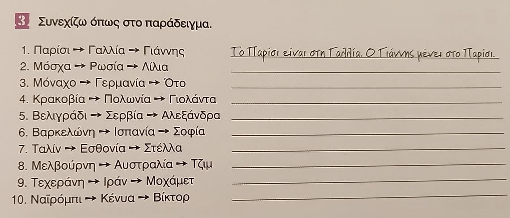
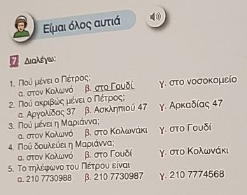
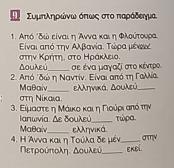
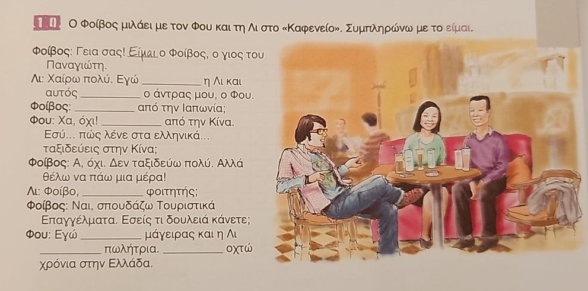
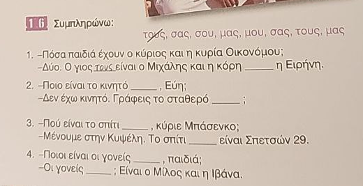

<style>
    .extra {
        display: block;
        color: rgb(255,255,255, 0.2);
    }
</style>
<!-- <span class="extra"> = Работает десять лет в компании. </span> -->


πηγαίνω - хожу, езжу
παω - я иду, еду



## 3 Συνεχίζω όπως στο παράδειγμα.
| a | b |
|--------------------|--------------------|
|Παρίσι ➝ Γαλλία ➝ Γιάννης          | **Το** Παρίσι είναι στη Γαλλία. Ο Γιάννης μένει **στο** Παρίσι. |
|Μόσχα ➝ Ρωσία ➝ Λίλια              | **Την** Μόσχα είναι στη Ρωσία. Η Λίλια μένει **στην** Μόσχα. |
|Μόναχο ➝ Γερμανία ➝ Ότο            | **Το** Μόναχο είναι στη Γερμανία. Ο Ότο μένει **στο** Μόναχο. |
|Κρακοβία ➝ Πολωνία ➝ Γιολάντα      | **Την** Κρακοβία είναι στην Πολωνία. Η Γιολάντα μένει **στην** Κρακοβία. |
|Βελιγράδι ➝ Σερβία ➝ Αλεξάνδρα     | **Το** Βελιγράδι είναι στη Σερβία. Η Αλεξάνδρα μένει **στο** Βελιγράδι. |
|Βαρκελώνη ➝ Ισπανία ➝ Σοφία        | **Η** Βαρκελώνη είναι στη Ισπανία. Η Σοφία μένει **στη** Βαρκελώνη. |
|Ταλίν ➝ Εσθονία ➝ Στέλλα           | **Το** Ταλίν είναι στην Εσθονία. Η Στέλλα μένει **στο** Ταλίν. |
|Μελβούρνη ➝ Αυστραλία ➝ Τζιμ       | **Η** Μελβούρνη είναι στην Αυστραλία. Ο Τζιμ μένει **στη** Μελβούρνη. |
|Τεχεράνη ➝ Ιράν ➝ Μοχάμετ          | **Η** Τεχεράνη είναι στο Ιράν. Ο Μοχάμετ μένει **στη** Τεχεράνη. |
|Ναϊρόμπι ➝ Κένυα ➝ Βίκτορ          | **Το** Ναϊρόμπι είναι στην Κένυα. Ο Βίκτορ μένει **στο** Ναϊρόμπι. |


<audio src="35 Track 35 1.mp3" style="width: 100%;" controls></audio>

- Με συγχωρείτε. Εδώ είναι η στάση για το τρόλεϊ; = Извините, это остановка троллейбуса?
- Ναι, εδώ. 
- Πού πηγαίνει; = Kуда едет?
- Στην Κηψέλη. 
- Σιγουρά; = Точно?
- Σίγουρα. Κάθε μέρα πάω στη Κηψέλη με το τρόλεϊ.
- Αλλά... Δεν περνάει από το κέντρο; = Но ведь не проезжает через центр?
- Ναι, το διος(2) ____ στο Σύνταγμα.
- Εντάξει λοίπόν. Πάω στο περίπτερο για εισιτήριο.
- Παρακαλώ, ειναι εισιτήριο για το τρόλεϊ; = Пожалуйста, это билет на троллейбус?
- Χωριστά. 
- Πόσο κάνει; = Сколько стоит?
- Ένα ευρώ
- -----
- Ναι, είναι το ίδιο εισιτήριο για το μετρό, το λεωφορείο, το τρόλεϊ και το τραμ
- Οχ, πα


<Είμαι όλος αυτιά = Я весь внимание
## 7 Διαλέγω


<audio src="31 Track 31 1.mp3" style="width: 100%;" controls></audio>

πού μένεις = где живешь

```
Πού μένει ο Πέτρος; ☑
☐ στον Κολωνό
☑ στο Γουδί
☐ στο νοσοκομείο

Πού ακριβώς μένει ο Πέτρος;
☐ Αργολίδος 37
☐ Ακαδημίας 47
☑ Αρκαδίας 47

Πού μένει η Μαριάννα;
☑ στον Κολωνό
☐ στο Κολωνάκι
☐ στο Γουδί

Πού δουλεύει η Μαριάννα;
☐ στον Κολωνό
☑ στο Γουδί
☐ στο Κολωνάκι

Το τηλέφωνο του Πέτρου είναι
☐ 210 7730988
☐ 210 7730987
☑ 210 7774568
```

## 9 Συμπληρώνω όπως στο παράδειγμα. = Заполняю как в примере.



1. Από δώ είναι η Άννα και η Φλούτουρα.
Είναι από την Αλβανία. Τώρα μένουν στην Κρήτη, στο Ηράκλειο.
Δουλεύουν σε ένα μαγαζί στο κέντρο.
Μαθαίνουν ελληνικά.

2. Από δώ η Ναντίν. Είναι από τη Γαλλία.
Μαθαίνει ελληνικά.
Δουλεύει στη Νίκαια.

3. Είμαστε η Μάικο και η Γιούρι από την Ιαπωνία.
Δε δουλεύουμε τώρα.
Μαθαίνουμε ελληνικά.

4. Η Άννα και η Τούλα δε μένουν στην Πετρούπολη.
Δουλεύουν εκεί.

```
Μαθαίνω = учу
εκεί = там
```


## 10 Ο Φοίβος μιλάει με τον Φου και τη Λι στο «Καφενείο». Συμπληρώνω με το είμαι. = Фивос разговаривает с Фу и Ли в кафе. Заполняю с помощью глагола "быть".



Φοίβος: Γεια σας! Είμαι ο Φοίβος, ο γιος του Παναγιώτη.

Λι: Χαίρω πολύ. Εγώ είμαι η Λι και αυτός είναι ο άντρας μου, ο Φου.

Φοίβος: Είστε από την Ιαπωνία;

Φου: Χα, όχι! Είμαστε από την Κίνα.

Εσύ… πώς λένε στα ελληνικά… ταξιδεύεις στην Κίνα; = А вы… как это по-гречески… путешествуете в Китай?

Φοίβος: Α, όχι. Δεν ταξιδεύω πολύ. Αλλά θέλω να πάω μια μέρα! = А, нет. Я не путешествую много. Но хочу поехать однажды!

Λι: Φοίβο, είσαι φοιτητής;

Φοίβος: Ναι, σπουδάζω Τουριστικά Επαγγέλματα. Εσείς τι δουλειά κάνετε; = Да, я изучаю туристические профессии. А вы кем работаете?

Φου: Εγώ είμαι μάγειρας και η Λι είναι πωλήτρια.

Είμαστε οχτώ χρόνια στην Ελλάδα.

```
οχτώ = восемь
```


## 16 Συμπληρώνω: = Заполните:



```
μου = мой
σου = твой
της = её
του = его


μας = наш
σας = ваш
τους = их
```

(της, σας, σου, μας, μου, σας, τους, μας)
(της, σας, , , , , τους, )

— Πόσα παιδιά έχουν ο κύριος και η κυρία Οικονόμου;
— Δύο. Ο γιος μας είναι ο Μιχάλης και η κόρη μας η Ειρήνη.

— Ποιο είναι το κινητό σου, Εύη;
— Δεν έχω κινητό. Γράφεις το σταθερό μου;

— Πού είναι το σπίτι σας, κύριε Μπάσενκο;
— Μένουμε στην Κυψέλη. Το σπίτι ______ είναι Σπετσών 29.

— Ποιοι είναι οι γονείς ______, παιδιά;
— Οι γονείς ______; Είναι ο Μίλος και η Ιβάνα.

```
Πόσα = Сколько
κινητό = мобильный телефон
Ποιο = Какой, который
σταθερό = стационарный (телефон)
Πού = Где
```