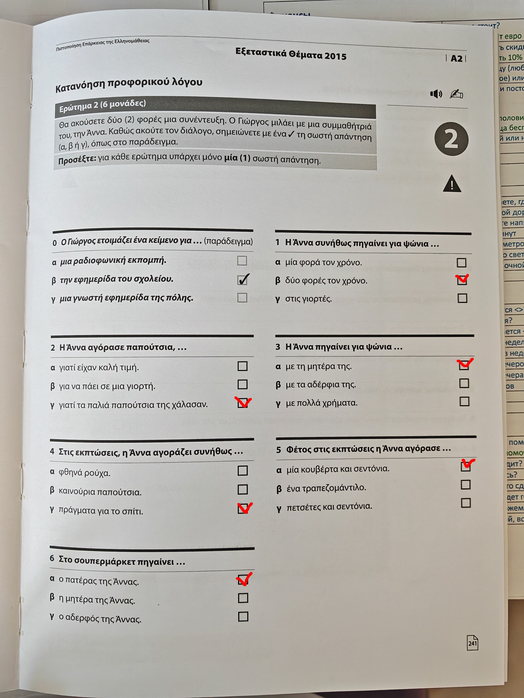
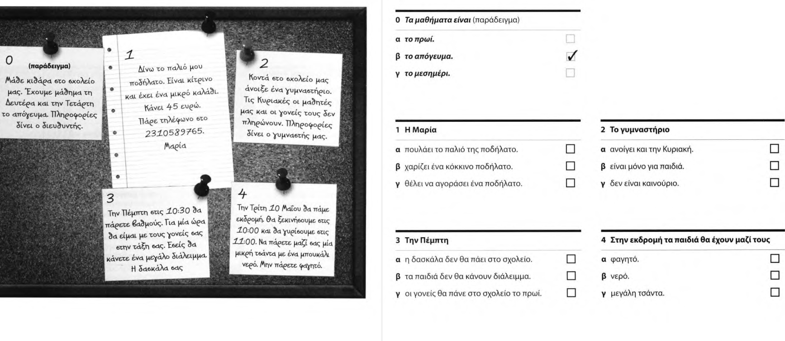

Ερώτημα 2 = Вопрос 2

```
άρθρο = статья
μερικές = несколько
βέβαια = конечно
συχνά = часто
Συνήθως = Обычно
γιορτές = праздники
Χριστούγεννα = Рождество

χάλασαν = испортились
χρήματα = деньги
όταν = когда
εκπτώσεις = скидки
Πολλές φορές = Часто
πράγματα = вещи
ψώνια = покупки

Πέρυσι = В прошлом году
Φέτος = В этом году
του χρόνου = в следующем году

αγορά = рынок
```


Καλημέρα Άννα
Γράφω ένα άρθρο για τη σχολική εφημερίδα Θα απαντήσεις σε μερικές ερωτήσεις;
Ναι βέβαια
Πηγαίνεις συχνά για ψώνια; = Ты часто ходишь за покупками?
Όχι πολύ συχνά
Συνήθως πηγαίνω στην αγορά  μία φορά    στην αρχή της σχολικής χρονιάς  και μία φορά στο τέλος της =
Обычно  я хожу  на рынок    один раз    в начале учебного года          и один раз в конце

Δεν πηγαίνεις για ψώνια στις γιορτές = Ты не ходишь за покупками на праздники?
Πηγαίνω μόνο αν πρέπει να πάρω κάτι = Я хожу только если нужно что-то купить

Πέρυσι          τα Χριστούγεννα για παράδειγμα  χάλασαν     τα παπούτσια μου    και αγόρασα καινούρια =
В прошлом году  на Рождество    например        испортились туфли мои           и я купила новые

Με ποιον    πηγαίνεις συνήθως για ψώνια = 
С кем       ты ходишь обычно  за покупками? 

Πηγαίνω πάντα με τη μαμά μου = 
Я хожу всегда с мамой моей

Μαζί βρίσκουμε πράγματα που είναι φθηνά και καλά = 
Вместе мы находим вещи, которые дешевые и хорошие

Δεν θέλουμε να ξοδέψουμε πολλά χρήματα = Мы не хотим тратить много денег
Έχω και άλλα δύο αδέρφια = У меня есть еще два брата
Καταλαβαίνεις; = Ты понимаешь?

Πηγαίνετε για ψώνια όταν έχει εκπτώσεις; = Вы ходите за покупками, когда есть скидки?
Ναι
αλλά δεν αγοράζουμε συνήθως ρούχα = но мы обычно не покупаем одежду

Πολλές φορές παίρνουμε πράγματα για το σπίτι

Φέτος τις εκπτώσεις πήρα καινούρια σεντόνια και μία ζεστή κουβέρτα = В этом году на распродажах я купила новые простыни и теплое одеяло

Στο σούπερ μάρκετ πηγαίνεις; = Ты ходишь в супермаркет?
Όχι καθόλου = Нет совсем
Αυτό το κάνει ο μπαμπάς μου = Это делает мой папа
Άννα ευχαριστώ πολύ για τον χρόνο σου = Анна, спасибо большое за твое время
Παρακαλώ = Пожалуйста



